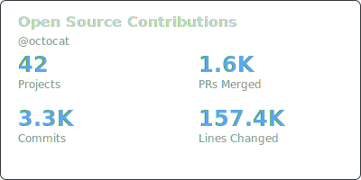
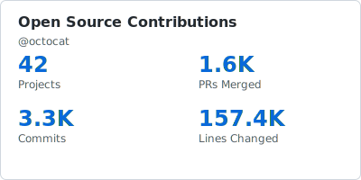
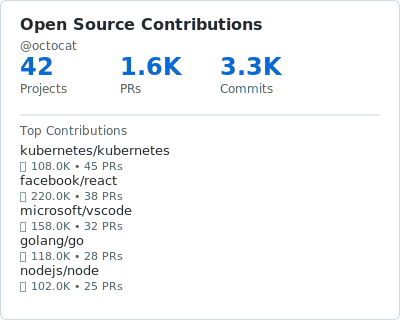

# Badge Generation Guide

Complete guide to generating SVG badges for your OSS contributions.

## Quick Start

```bash
# Generate a badge (uses default: summary style, dark theme)
gh-oss-stats --user YOUR_USERNAME --badge

# Customize style and theme
gh-oss-stats --user YOUR_USERNAME --badge \
  --badge-style compact \
  --badge-theme light \
  --badge-output my-badge.svg
```

## Badge Styles

### Summary (400×200)

Comprehensive overview with 4 key metrics.

**Dark Theme:**


**Light Theme:**


**CLI Command:**
```bash
gh-oss-stats --user mabd-dev --badge --badge-style summary --badge-theme dark
```

**Use Case:** README headers, profile pages, portfolios

---

### Compact (280×28)

Shields.io style horizontal badge - perfect for inline use.

**Dark Theme:**


**Light Theme:**


**CLI Command:**
```bash
gh-oss-stats --user mabd-dev --badge --badge-style compact --badge-theme light
```

**Use Case:** Inline in README, status bars, small spaces

---

### Detailed (400×320)

Full statistics with top 5 contributions list.

**Dark Theme:**


**Light Theme:**


**CLI Command:**
```bash
gh-oss-stats --user mabd-dev --badge --badge-style detailed --badge-theme dark
```

**Use Case:** Detailed portfolio sections, contribution showcases

---

### Minimal (120×28)

Simple project count badge.

**Dark Theme:**


**Light Theme:**


**CLI Command:**
```bash
gh-oss-stats --user mabd-dev --badge --badge-style minimal --badge-theme light
```

**Use Case:** Minimalist designs, quick stats

---

## Advanced Options

### Sorting (Detailed Badge Only)

Control how contributions are sorted in the detailed badge:

```bash
# Sort by PRs merged (default)
gh-oss-stats --user mabd-dev --badge --badge-style detailed --badge-sort prs

# Sort by repository stars
gh-oss-stats --user mabd-dev --badge --badge-style detailed --badge-sort stars

# Sort by total commits
gh-oss-stats --user mabd-dev --badge --badge-style detailed --badge-sort commits
```

### Contribution Limit (Detailed Badge Only)

Control how many contributions to show:

```bash
# Show top 3 contributions
gh-oss-stats --user mabd-dev --badge --badge-style detailed --badge-limit 3

# Show top 10 contributions
gh-oss-stats --user mabd-dev --badge --badge-style detailed --badge-limit 10
```

### Custom Output Path

```bash
# Save to custom location
gh-oss-stats --user mabd-dev --badge --badge-output path/to/badge.svg

# Generate both JSON stats and badge
gh-oss-stats --user mabd-dev \
  -o stats.json \
  --badge --badge-output badge.svg
```

## Theme Comparison

| Feature | Dark Theme | Light Theme |
|---------|------------|-------------|
| Background | `#0d1117` (GitHub dark) | `#ffffff` (white) |
| Text | `#c9d1d9` (light gray) | `#24292f` (dark gray) |
| Accent | `#58a6ff` (GitHub blue) | `#0969da` (GitHub blue) |
| Use Case | Dark mode sites, modern look | Light mode sites, traditional |

## All CLI Flags

| Flag | Type | Default | Description |
|------|------|---------|-------------|
| `--badge` | bool | `false` | Enable badge generation |
| `--badge-style` | string | `"summary"` | Badge style: summary, compact, detailed, minimal |
| `--badge-theme` | string | `"dark"` | Color theme: dark, light |
| `--badge-output` | string | `"badge.svg"` | Output file path |
| `--badge-sort` | string | `"prs"` | Sort by: prs, stars, commits (detailed only) |
| `--badge-limit` | int | `5` | Max contributions shown (detailed only) |

## Embedding in README

### Standard Markdown

```markdown

```

### With Link

```markdown
[](https://github.com/YOUR_USERNAME)
```

### HTML (with size control)

```html

```

## Automation with GitHub Actions

Generate and commit badges automatically:

```yaml
name: Update OSS Badge

on:
  schedule:
    - cron: '0 0 * * 0'  # Weekly
  workflow_dispatch:

jobs:
  update-badge:
    runs-on: ubuntu-latest
    steps:
      - uses: actions/checkout@v3
      
      - name: Install gh-oss-stats
        run: |
          go install github.com/gh-oss-tools/gh-oss-stats/cmd/gh-oss-stats@latest
      
      - name: Generate badge
        env:
          GITHUB_TOKEN: ${{ secrets.GITHUB_TOKEN }}
        run: |
          gh-oss-stats --user ${{ github.actor }} \
            --badge --badge-style summary \
            --badge-output docs/oss-badge.svg
      
      - name: Commit badge
        run: |
          git config user.name "github-actions[bot]"
          git config user.email "github-actions[bot]@users.noreply.github.com"
          git add docs/oss-badge.svg
          git commit -m "Update OSS contributions badge" || exit 0
          git push
```

## Tips & Best Practices

### 1. Choose the Right Style

- **Summary**: Best for prominent placement (README header, portfolio)
- **Compact**: Best for inline text, multiple badges side-by-side
- **Detailed**: Best for dedicated contributions section
- **Minimal**: Best for minimalist designs, footer badges

### 2. Theme Selection

- Use **dark** theme for:
  - Dark mode websites
  - Modern/tech-focused projects
  - GitHub's dark theme
  
- Use **light** theme for:
  - Light mode websites
  - Traditional/professional sites
  - Print-friendly versions

### 3. Detailed Badge Configuration

```bash
# Showcase popular projects
gh-oss-stats --user mabd-dev --badge --badge-style detailed \
  --badge-sort stars --badge-limit 10

# Showcase most active contributions
gh-oss-stats --user mabd-dev --badge --badge-style detailed \
  --badge-sort prs --badge-limit 5

# Showcase long-term contributions
gh-oss-stats --user mabd-dev --badge --badge-style detailed \
  --badge-sort commits --badge-limit 10
```

### 4. Responsive Design

For responsive layouts, consider using multiple badges:

```markdown
<!-- Desktop: Detailed badge -->


<!-- Mobile: Compact badge -->

```

## Troubleshooting

### Badge doesn't display in GitHub README

- Ensure the SVG file is committed to your repository
- Use relative paths: ``
- Check file permissions (should be readable)

### Colors look wrong

- Verify you're using the correct theme (dark vs light)
- Check if your platform supports SVG properly
- Try viewing in a different browser

### Badge shows old data

- Regenerate the badge: `gh-oss-stats --user YOUR_USER --badge`
- Commit and push the updated SVG
- Clear browser cache if viewing on web

## Examples in the Wild

Want to see real examples? Check out these repositories:

- [Example 1](#) - Using summary badge in README header
- [Example 2](#) - Using compact badges inline
- [Example 3](#) - Using detailed badge in contributions section

## Contributing

Found a bug or have a feature request? Open an issue at [gh-oss-stats](https://github.com/gh-oss-tools/gh-oss-stats/issues).

---

**Need help?** See the main [README](../README.md) or [open an issue](https://github.com/gh-oss-tools/gh-oss-stats/issues).
